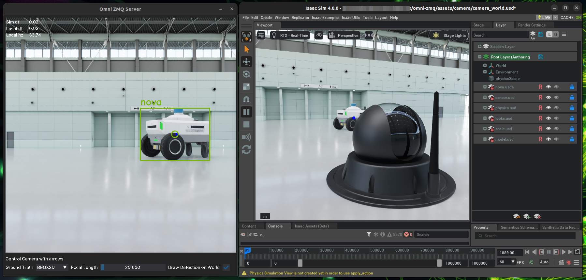

# Omniverse ZMQ Bridge

## Motivation

[Omniverse](https://www.nvidia.com/en-eu/omniverse/) is the most advanced simulator for vision-based systems and robots. 
It has great built-in support for ROS communication of sensory data, but not everyone is using ROS. 
This extension is built to provide a simple and performant method to communicate sensory and general data to/from the simulator, using only Python. The extension is built on top of [PyØMQ](https://pyzmq.readthedocs.io/en/latest/)

## Design

The program consists of a client and a server. 
The client is the Omniverse application. 
The server is a Python app, running inside a Docker container. The server aims to mimic or act as a foundation for running vision models and building behavior logics that will be communicated back to the simulator, forming a SIL (Software in the loop). 
Later, this can be converted to run on an edge device to form HIL (Hardware in the loop).



## Requirements

1. Linux Ubuntu / Windows (WSL2)
2. [NVIDIA Isaac SIM](https://docs.omniverse.nvidia.com/isaacsim/latest/installation/install_workstation.html)
3. Docker

## Quick start

Clone this repo 
``` bash
git clone https://github.com/liorbenhorin/omni-zmq.git
cd omni-zmq
```

> This extension and sample files are designed for [Isaac SIM](https://docs.omniverse.nvidia.com/isaacsim/latest/index.html). 
> It leverages the Isaac SIM API to simplify the interaction with a 2DoF camera. 
> The user can run this extension on any other Kit-based application, but they will need to remove the Isaac SIM API dependencies.


### Client (Omniverse Extension)

1. Launch Isaac SIM app.
2. Open the Window->Extensions from the top menu.
3. In the Extensions manager window, open the settings from the "hamburger" button near the search field.
4. In the paths list, click the "+" button and add the path to where you cloned this repo + `/exts`.
5. After adding the path, you will see the `LBENHORIN ZMQ BRIDGE` extension in the Third-Party tab, enable it and set it to Auto Load.
6. Open the file `example_stage.usd` from the `assets` folder in this repo.

### Server (Python app)

> The Docker run command already introduces flags to enable NVIDIA CUDA support and GUI support. 
> This is dependent on the [NVIDIA Container Toolkit](https://docs.nvidia.com/datacenter/cloud-native/container-toolkit/latest/install-guide.html)
> Also, the flags are written for a Linux Ubuntu environment.
> On Windows, it is recommended to run the server from within [WSL](https://learn.microsoft.com/en-us/windows/wsl/about).
> This way is confirmed to support the app UI and CUDA if needed.

1. Build the docker image and run it 
```bash
cd omni-zmq-server
./build_server.sh
./run_server.sh
```
2. Inside the container, run the server 
```bash
python3 server.py
```

### Communication
On the Isaac SIM side, click the `Reset World` button and then `Start RGB Streaming`.

You should see the sensor data displayed on the server side. You can use the arrow keys on the server side to rotate the camera and the focal length slider.


## Next steps

After running this basic example, it is time to learn how this extension works and extend it.

First, it is recommended to use VSCode as your IDE. Start by linking the repo to your Kit app (in our case, it will be the path to where Isaac SIM is installed).

From the root of this repo, run
`./link_app.sh --path <your isaac sim install path>`

After a successful link, please restart VSCode.

The extensions in Omniverse leverage hot-reload, meaning every time you save a file under the `/exts` folder, Kit will reload the extension. Be mindful of this.

The Docker run script has mounted the `/omni-zmq-server/src` folder, so you can make changes to the code while the container is running.


> Try to install and run a vision model like YOLO inside the container!